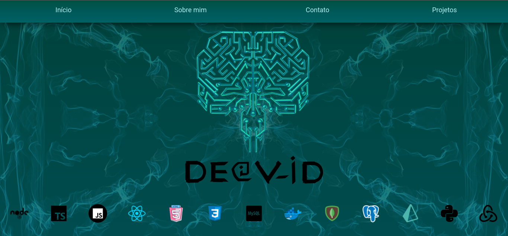

<h1 align="center">
  Portfólio - Deivid Borges
</h1>

<h1 align="center">
  
</h1>
<h3 align="center">
  <a href="DeividBorges93.github.io" target="_blank" rel="noreferrer">
      
Clique aqui ou na imagem para visitar o portfólio

    </a>
</h3>

 

# Páginas 

O projeto possui atualmente 4 páginas:

* [Início](./src/pages/Home.jsx): Nessa tela temos a minha logo no centro, com as logos das ferramentas que sei usar clicaveis com links para seus sites ou documentações. (imagem a cima)
* [Sobre mim](./src/pages/Aboutme.jsx): Nessa tela como o próprio nome diz, falo um pouco sobre quem sou eu, minha formação, o que eu estou buscando e aprendendo. 
* [Contato](./src/pages/Contact.jsx): Aqui temos os links para linkedin e github. Além de um formulário no qual você pode me mandar uma mensagem que vai diretamente para o meu e-mail.
* [Projetos](./src/pages/Projects.jsx): Aqui se encontram os projetos que eu desenvolvi. Atualmente tenho aqui os dois últimos projetos, porém no github você encontra mais projetos.

Possui também um HEADER que se esconde quando o mouse sai de cima, e retorna quando o mouse se aproxima.

 

# Tecnologias utilizadas

* Reactjs
* JavaScript
* HTML5
* CSS3
* Emailjs

Nesse projeto decidi começar com JavaScript pois fazia algu mtempo que vinha desenvolvendo em TypeScript, pretendo fazer transição para TS como uma forma de estudo. 
 
Frontend feito com React, por ser uma framework que já tenho conhecimento. 
 
O CSS está puro pois me sinto mais livre em criar coisas direto do zero. 

 

# Features futuras

* Footer
* Mais projetos na página de projetos
* Carrosel de imagens nos card dos projetos
* Mudança na localização das tecnologias na home page
